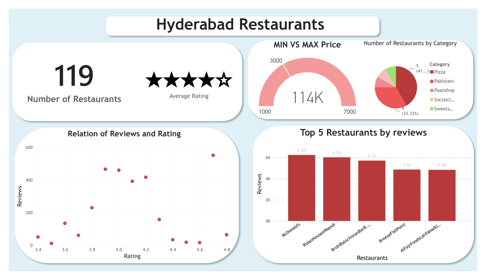

# 🍽️ Hyderabad Restaurant Market Analysis

## 📌 Project Overview

This project analyzes restaurant data collected from Google Maps in Hyderabad, Pakistan. The objective was to perform an end-to-end data analytics workflow including data cleaning, SQL analysis, exploratory data analysis (EDA), and interactive dashboard development using Power BI.

The project demonstrates practical skills in data collection, data preprocessing, SQL querying, Python analysis, and business intelligence reporting.

---

## 🎯 Objectives

- Analyze restaurant ratings and customer reviews.
- Identify the most popular restaurant categories.
- Explore relationships between ratings and customer engagement.
- Build an interactive dashboard for business insights.

---

## 🛠 Tools & Technologies

- Microsoft Excel
- MySQL
- Python
  - Pandas
  - NumPy
  - Matplotlib
- Power BI
- Git & GitHub

---

## 📊 Dashboard Features

### Executive KPIs

- Total Restaurants
- Average Rating
- Minimum vs Maximum Price

### Visualizations

- Restaurants by Category
- Relationship Between Ratings and Reviews
- Top Rated Restaurant Categories

---

## 📈 Key Insights

- Analyzed data from **119 restaurants** across Hyderabad.
- Most restaurants maintain customer ratings above **4.0**, indicating generally positive customer satisfaction.
- Categories such as Social Clubs and Paan Shops achieved the highest average ratings.
- Restaurants with higher customer reviews generally maintain stronger ratings, indicating a positive relationship between popularity and customer satisfaction.

---

## 📂 Project Workflow

1. Data Collection
2. Data Cleaning using Excel
3. SQL Analysis using MySQL
4. Exploratory Data Analysis (Python)
5. Interactive Dashboard Development (Power BI)

---

## 📸 Dashboard Preview

---

## 🚀 Skills Demonstrated

- Data Cleaning
- Data Analysis
- SQL Queries
- Exploratory Data Analysis
- Data Visualization
- Dashboard Development
- Business Intelligence
- Power BI
- Microsoft Excel
- Python

---

## 👨‍💻 Author

Muhammad Zaman

LinkedIn:[(Muhammad Zaman)](https://www.linkedin.com/in/muhammad-zaman-ds2k24/)

GitHub: [(Muhammad Zamam)](https://github.com/Muhammad-Zaman-DS)
